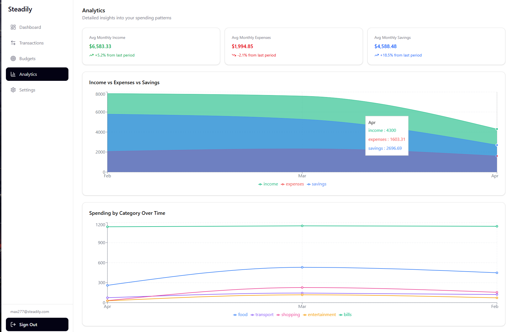
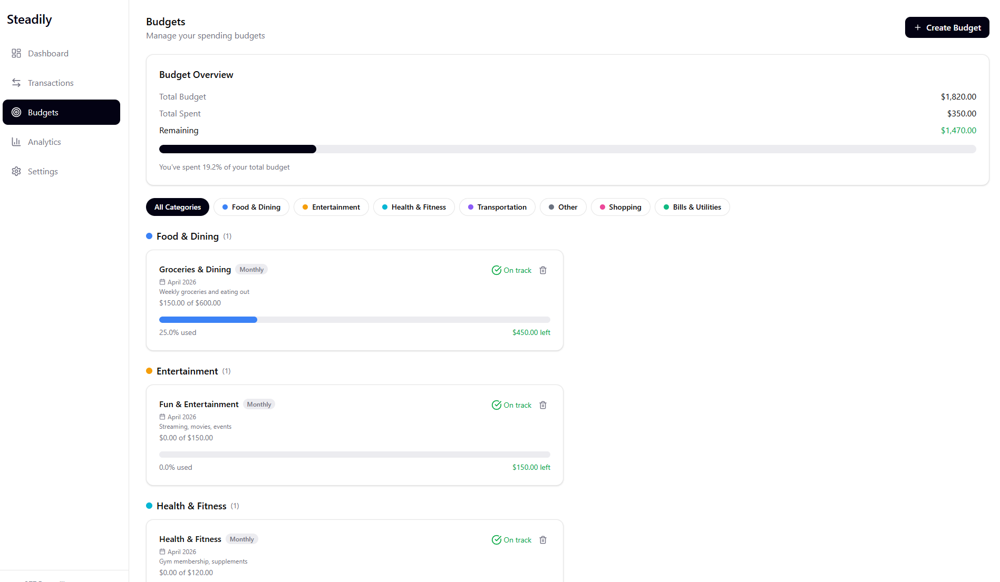
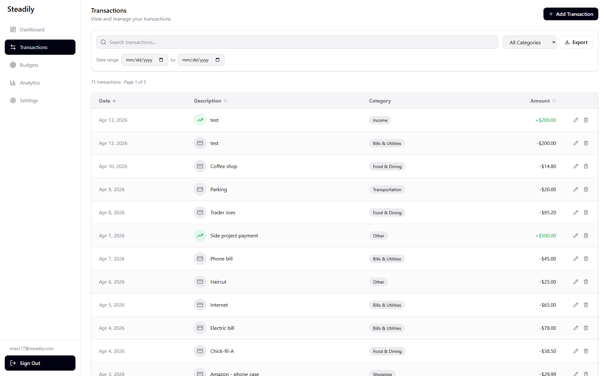
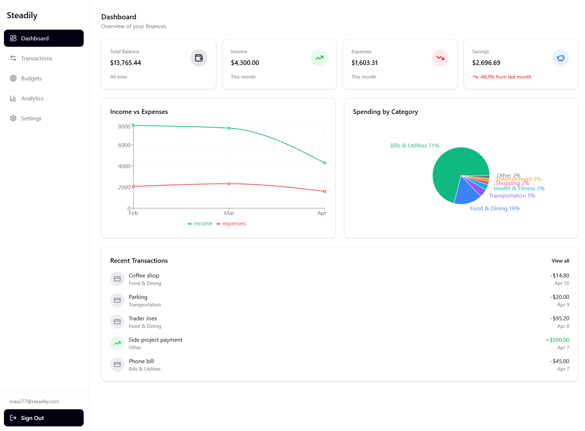

# Steadily

<p align="center">
  
  
  
  
</p>

A full-stack personal finance application for tracking income, expenses, and budgets. Built with React on the frontend and a serverless Python backend deployed to AWS Lambda.

URL: https://d17qicjfvn0awy.cloudfront.net/


## Motivation

I built Steadily to deepen my understanding of serverless architecture and modern CI/CD practices. I wanted hands-on experience designing a system where the frontend and backend are fully decoupled, deployed independently, and automated through GitHub Actions. A finance tracker made sense as the project vehicle because it requires real CRUD operations, relational data (users, categories, transactions, budgets), and meaningful data aggregation for analytics — problems that go beyond a typical tutorial app.

## Architecture

```
┌─────────────┐       ┌──────────────────┐       ┌────────────┐
│  React SPA  │──────▶│  API Gateway     │──────▶│  Lambda    │
│  (S3 + CF)  │       │  (REST API)      │       │  (Python)  │
└─────────────┘       └──────────────────┘       └─────┬──────┘
                                                       │
                                                 ┌─────▼──────┐
                                                 │  Supabase   │
                                                 │  (Postgres) │
                                                 └─────────────┘
```

**Frontend** — React SPA hosted on S3 with CloudFront for HTTPS and CDN caching.

**Backend** — A lightweight Python API (no framework) running on AWS Lambda behind API Gateway. I chose to write the routing and request handling from scratch rather than use Flask or FastAPI to better understand what those frameworks abstract away. The Lambda handler translates API Gateway events into route dispatches, and psycopg2 manages connections to a Supabase-hosted PostgreSQL database.

**Database** — Supabase Postgres with row-level security. The schema covers users/profiles, categories, transactions, and budgets. Analytics are computed directly from the transactions table using aggregate queries rather than materialized views, keeping the architecture simple.

**CI/CD** — GitHub Actions for both repos. Pushing to `master` triggers automated builds and deployments — the frontend builds and syncs to S3 (with CloudFront cache invalidation), and the backend packages dependencies with Linux-compatible binaries and updates the Lambda function code.

## Key Technical Decisions

- **No backend framework** — Lambda functions don't need the overhead of Flask/FastAPI. The handler is a simple path-based router that maps requests to route modules. This keeps cold starts fast and the deployment package small.
- **JWT auth via Supabase** — Authentication is handled by Supabase Auth. The backend verifies JWTs using Supabase's JWKS endpoint, so there's no need to manage user credentials or session storage directly.
- **Event-driven UI updates** — A lightweight event emitter syncs data across pages. When a transaction is created, updated, or deleted, events propagate to the budget, dashboard, and analytics hooks so they re-fetch without requiring a full page reload or global state management.
- **Snake_case ↔ camelCase normalization** — The backend uses Python/SQL conventions (snake_case) and the frontend uses JavaScript conventions (camelCase). A thin normalization layer in the service files handles the mapping so neither side has to compromise.

## Tech Stack

| Layer | Technology |
|-------|-----------|
| Frontend | React 19, Vite, Tailwind CSS v4, React Router v7, Recharts |
| Backend | Python, psycopg2, PyJWT |
| Database | Supabase (PostgreSQL) |
| Infrastructure | AWS Lambda, API Gateway, S3, CloudFront |
| CI/CD | GitHub Actions |

## Features

- **Dashboard** — Summary cards (cumulative balance, monthly income/expenses/savings), income vs. expenses trend chart, spending by category breakdown, recent transactions
- **Transactions** — Full CRUD with search and category filtering, CSV export, income budget allocation with percentage-based distribution
- **Budgets** — Category-based budgets with spent amounts computed live from transactions, grouped display with category filter, income allocation increases budget ceilings
- **Analytics** — Monthly spending trends, category breakdowns, spending comparisons
- **Auth** — Email/password registration with email verification, JWT-based session management, automatic redirect on token expiration

## Getting Started

### Prerequisites

- Node.js 20+
- npm

### Local Development

```bash
# Install dependencies
npm install

# Create environment file
cp .env.example .env
# Edit .env to set VITE_API_BASE_URL (local backend or deployed Lambda)

# Start dev server
npm run dev
```

### Environment Variables

| Variable | Description |
|----------|-------------|
| `VITE_API_BASE_URL` | Backend API base URL (e.g. `http://localhost:5000/api` for local dev) |

### Backend

The backend lives in a [separate repository](https://github.com/cjrojas72/steadily-backend). See its README for setup instructions. For local development, run the backend's `local_server.py` on port 5000 and point `VITE_API_BASE_URL` at `http://localhost:5000/api`.

## Deployment

Both frontend and backend deploy automatically via GitHub Actions on push to `master`.

**Frontend** — Builds the Vite app, syncs `dist/` to S3, and invalidates the CloudFront cache.

**Backend** — Packages Python dependencies with Linux-compatible binaries and updates the Lambda function code via the AWS CLI.

## License

MIT
